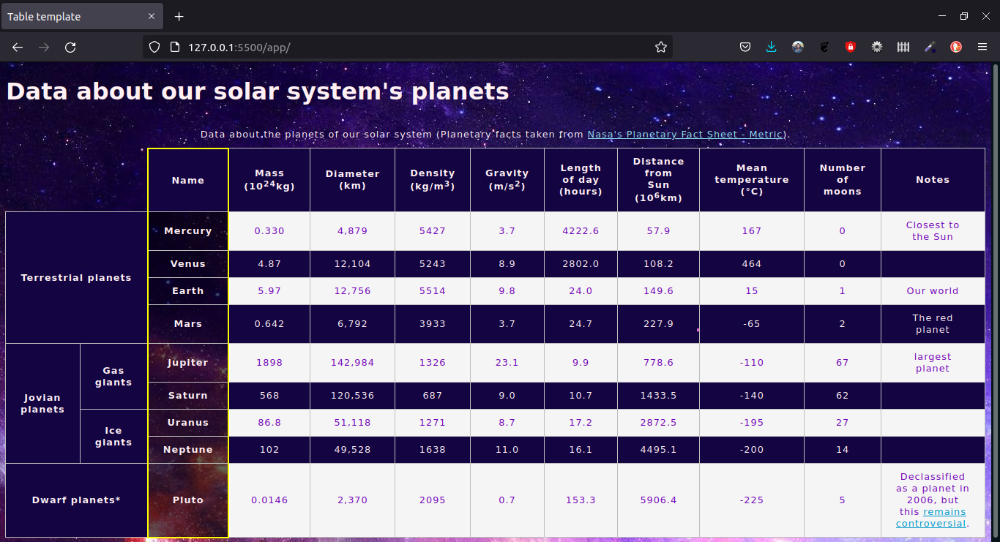

# Assessment: Structuring planet data

## Description

This is the finished table of the MDN **HTML table** module assessment.

## Screenshots

### With original styles

### With custom styles

## Credits

You can find the assessment at [Structuring planet data](https://developer.mozilla.org/en-US/docs/Learn/HTML/Tables/Structuring_planet_data)
